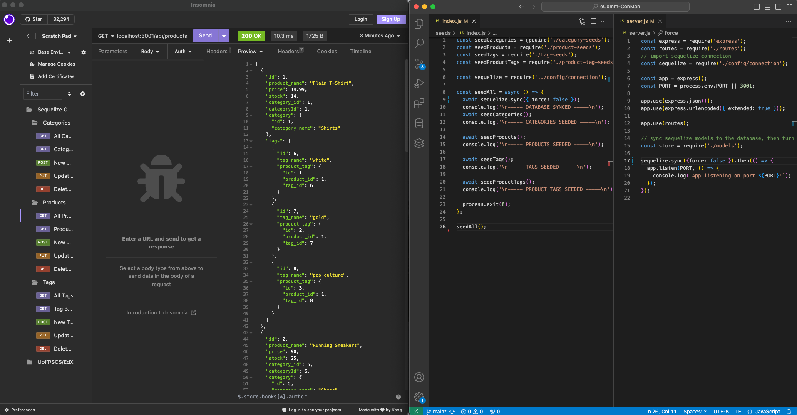

# eComm-ConMan

## Description

An eCommerce Content Management System, (or, more specifically,) the back-end of one. This, then, is a series of models and associations that are composed with the intention they be queried with a local HTTP request program like Insomnia in order to demonstrate functional usage of Sequelize.

## Installation/Usage Demo Video

[Click here to watch the demo video](https://drive.google.com/file/d/1GXfq_am0-WVdOEPs85ZX-FYZNaKP_TSw/view)

## Technologies

### Sequelize
### mySQL
### Node.js
### JavaScript
### HTML
### CSS

## Credits & Sources

Information and documentation used in the creation of this app, but external to the EdX UofT Full-Stack Software Development Bootcamp including syntaxes, best practises and instructional examples for usage came from the following sources:

- https://sequelize.org/docs/v6/core-concepts/model-basics/#model-synchronization
- https://sequelize.org/docs/v6/core-concepts/model-basics/#extending-model
- https://sequelize.org/docs/v6/core-concepts/model-basics/#data-types
- https://sequelize.org/docs/v6/core-concepts/assocs/

## License

See LICENSE file in repository
